# MusicApp

MusicApp 是一款使用 Kotlin 与 Jetpack Compose 构建的现代化 Android 本地音乐播放器。应用完全离线运行，围绕本地媒体库、后台播放、同步歌词、播放列表和自适应界面提供完整的首版体验。

## 当前状态

首版 26 项核心需求已基本完成代码实现，并已完成单元测试、Lint 与 Debug 构建收口；当前主要剩余工作是真机上的扫描、播放、系统媒体控制、视觉和交互验收。

## 界面预览

### 当前 App 页面

<p align="center">
  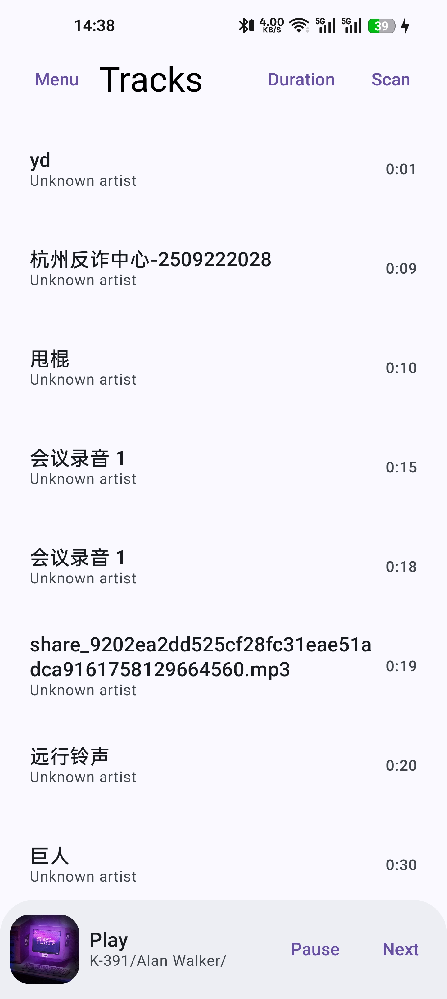
  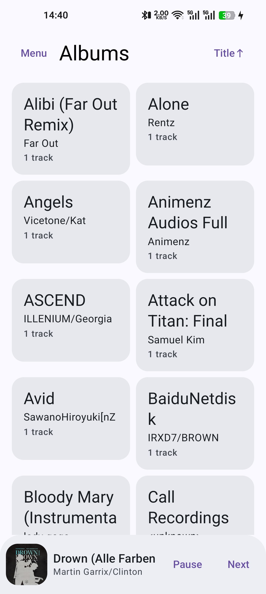
  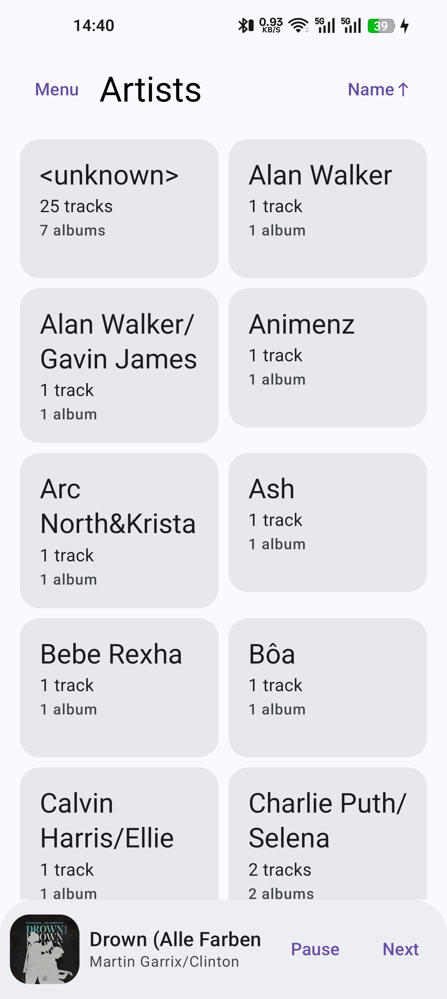
  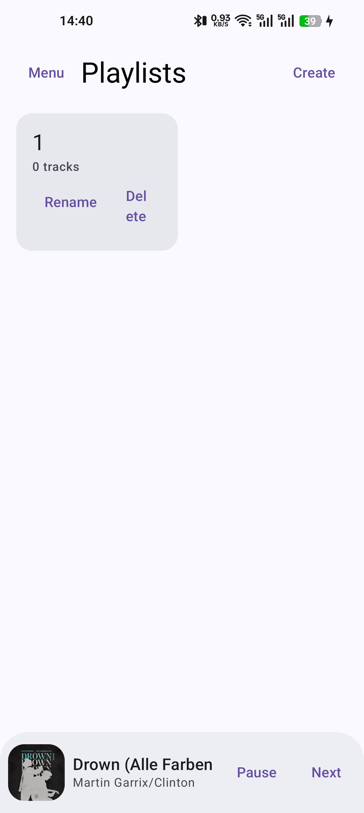
  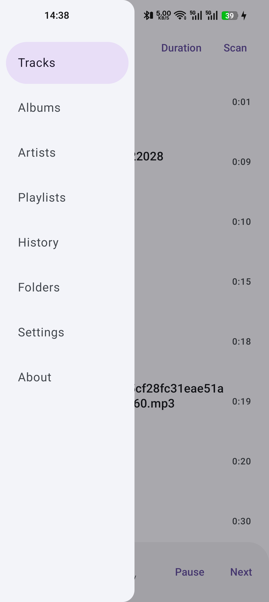
</p>

### 目标页面样式

以下图片是后续视觉与交互验收的目标样式，不代表当前 App 已达到完全一致的视觉效果。

<p align="center">
  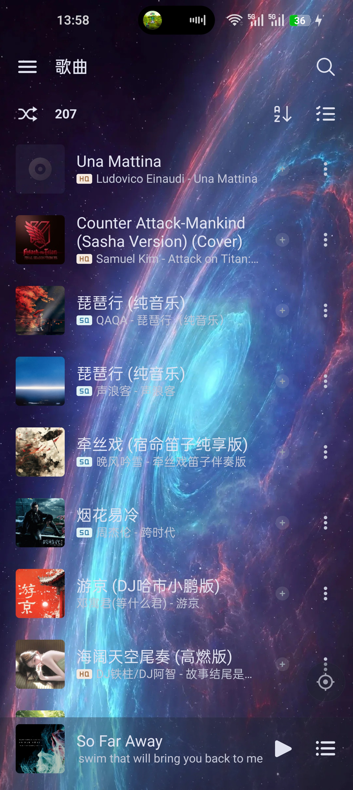
  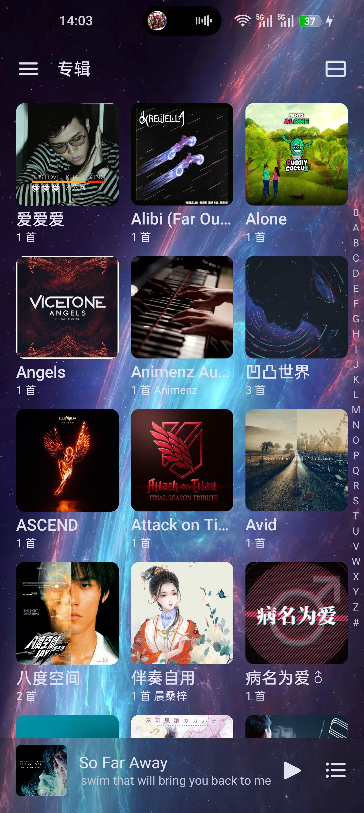
  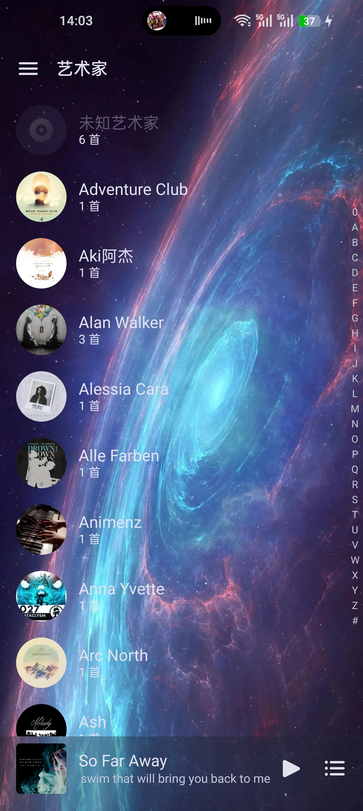
  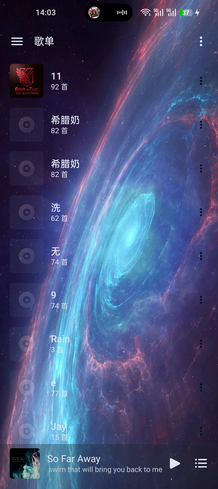
  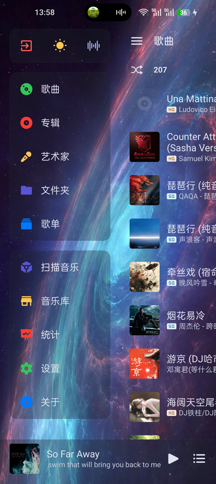
  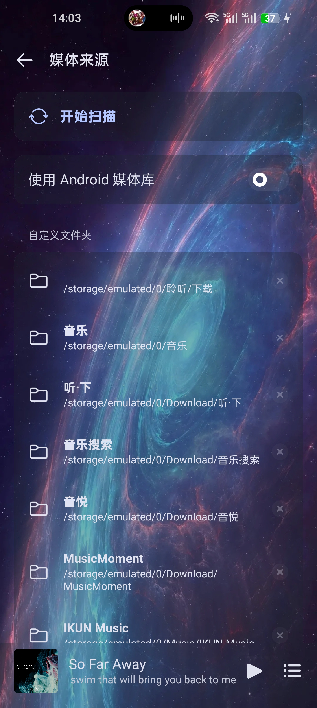
</p>

## 核心功能

- 通过 MediaStore 扫描 `.mp3`、`.flac`、`.wav`、`.aac`、`.m4a`、`.ogg`、`.opus`，支持全盘或指定目录同步、排除规则和增量更新。
- 提供单曲、专辑、艺术家、文件夹、播放列表和播放历史浏览，以及排序、多选、隐藏和批量操作。
- 使用单一 ExoPlayer、MediaLibraryService 与 MediaSession 实现后台播放、系统媒体控制、播放快照和三种播放模式。
- 支持可调节的单播放器淡出淡入切歌、稳定随机队列、播放队列编辑和“下一首播放”。
- 支持外部 LRC、内嵌 SYLT/USLT 同步歌词、内嵌封面、高级音频元数据和歌曲信息查看。
- 提供 Mini/Full Player Sheet、手机/平板/折叠屏自适应导航、Material You、多套明暗主题、Aero 动态背景及中英双语。

## 技术栈

| 类别 | 方案 |
| --- | --- |
| 平台 | Android，`minSdk 26`，`targetSdk 36` |
| 语言与工具链 | Kotlin 2.x，JDK 17，Gradle |
| UI | Jetpack Compose，Material 3，Navigation 3 |
| 播放 | AndroidX Media3，ExoPlayer，MediaSession，MediaLibraryService |
| 架构 | 单向数据流、ViewModel、Coroutines、StateFlow、Hilt |
| 数据 | Room、Preferences DataStore、MediaStore |
| 模块 | 单一 `:app` 模块，按 `core/*`、`data/*`、`feature/*` 分层 |

## 构建与运行

准备 JDK 17、Android SDK 36 与 Android Studio 后，在仓库根目录执行：

```bash
./gradlew :app:assembleDebug
```

Debug APK 输出到：

```text
app/build/outputs/apk/debug/app-debug.apk
```

连接 Android 设备或启动模拟器后可安装：

```bash
adb install -r app/build/outputs/apk/debug/app-debug.apk
```

首次进入媒体库时，Android 13 及以上版本需要授予“音乐和音频”权限，Android 12 及以下版本需要授予存储读取权限。

## 质量验证

项目 CI 固定使用 JDK 17 执行以下门禁：

```bash
./gradlew :app:testDebugUnitTest :app:lintDebug :app:assembleDebug --console=plain
```

设备、视觉与完整交互验收由人工执行，不作为 CI 门禁。

## 项目结构

```text
app/src/main/java/com/musicapp/player/
├── core/       # 领域模型、设计系统、歌词、媒体与播放规则
├── data/       # Room、DataStore、MediaStore、Repository 与同步
├── feature/    # 媒体库、播放器、歌词、播放列表、设置等页面
├── media/      # Media3 播放、MediaSession 与后台服务
├── navigation/ # Navigation 3 路由与状态
└── ui/         # 应用壳层与共享 UI
```

## 文档

- [设计与需求索引](docs/design/design-review-index.md)
- [首版实现规格](docs/design/implementation-spec.md)
- [逐过程执行计划](docs/plan/implementation-execution-plan.md)
- [开发 Wave Plan](docs/plan/implementation-wave-plan.md)
- [领域词汇](docs/CONTEXT.md)
- [架构决策记录](docs/adr/)
