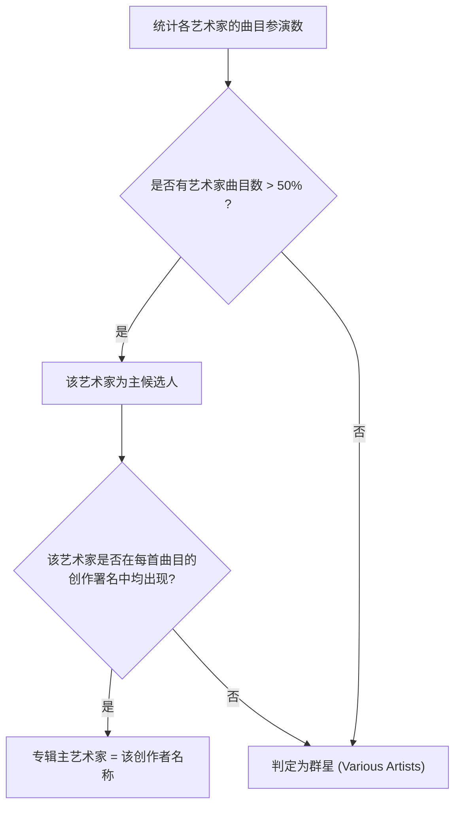

# 专辑分组聚合规则与维护规范

本文档维护当前项目中关于“应用层专辑聚合、版本识别、未知专辑归档与群星合辑判定”的硬编码业务规则。
代码层面的唯一事实来源为：
[`app/src/main/java/com/musicapp/player/feature/albums/AlbumGroupingRules.kt`](../../app/src/main/java/com/musicapp/player/feature/albums/AlbumGroupingRules.kt)。

---

## 1. 业务背景与聚合目标

在 Android 设备中，由于导入来源多样（抓轨、下载、不同播放器打标），同一张专辑的音轨可能被系统赋予不同的 `album_id`，或者同一标题的专辑实际上存在“普通版”与“豪华版/现场版”的区别。
依据 [ADR-0016: 使用应用层 AlbumGroupKey 聚合多歌手同名专辑](../../docs/adr/0016-use-application-level-album-group-key.md)，应用在展示层进行应用层聚类：
1. **同卷同标题合并**：同一存储卷内，规范化专辑名相同且版本关键词兼容的曲目归为同一专辑；
2. **多版本隔离**：版本修饰词（如 Live、Remix、Deluxe）不同的专辑严禁合并；
3. **主客观一致**：群星合辑与单一作者专辑有清晰明确的判定分界线。

---

## 2. 版本修饰词关键词规则

代码常量：`AlbumGroupingRules.VERSION_KEYWORD_REGEX`

正则表达式定义：
```regex
(?i)\b(live|remix|deluxe|acoustic|instrumental|bonus|edition|version|remaster|remastered)\b
```

### 匹配词汇清单与业务场景

| 关键词 | 典型专辑标题示例 | 业务说明 |
| :--- | :--- | :--- |
| `live` | 《Jay Chou 2007 Live》 | 现场录音版，与棚录正式版隔离 |
| `remix` | 《Club Remixes Vol.1》 | 混音重制版本 |
| `deluxe` | 《1989 (Deluxe Edition)》 | 豪华加曲版，与普通版隔离 |
| `acoustic` | 《MTV Unplugged / Acoustic》 | 原声/不插电不完全同轨版本 |
| `instrumental` | 《Soundtrack (Instrumental)》 | 纯器乐伴奏版 |
| `bonus` | 《Album (Bonus Track Version)》 | 附赠曲目再版 |
| `edition` | 《Special Edition》 | 特别限定版标记词 |
| `version` | 《Tour Version》 | 巡演版/特定发行版本标记词 |
| `remaster` / `remastered` | 《Abbey Road (2019 Remaster)》 | 母带重制版，与原版发布年份/曲目分离 |

### 聚类逻辑
在判断两组曲目是否归为同一张专辑时，系统会提取各自标题中的版本关键词集合。若关键词集合不同（例如一个包含 `deluxe`，另一个为空），则即便规范化主标题完全一致，也不会合并为同一张专辑。

---

## 3. 群星合辑（Various Artists）判定规则

代码常量：`AlbumGroupingRules.VARIOUS_ARTISTS_SENTINEL`（`"<various_artists>"`）与 `AlbumGroupingRules.PRIMARY_ARTIST_MIN_RATIO`（`0.5`）

当一张专辑中的曲目由多位不同艺术家演唱时，确定专辑展示的主艺术家名称采用以下规则：



- **门限说明**：
  - 核心条件 1：主创作者的参演曲目数必须超过总曲目数的 50%（`maxCount * 2 > stableTracks.size`）；
  - 核心条件 2：该主创作者必须参与了专辑内的**每一首**曲目（允许与其他歌手合作，但不可完全缺席某首歌曲）。
  - 任一条件不满足，专辑艺术家即归为群星 `<various_artists>`，双语本地化展示为“群星”/“Various Artists”。

---

## 4. 未知专辑（Unknown Album）归档规范

代码常量：`AlbumGroupingRules.UNKNOWN_ALBUM_SENTINEL`（`"<unknown_album>"`）与 `AlbumGroupingRules.UNKNOWN_ALBUM_ID`

- **归档条件**：
  - 音轨的 `albumId == null`，或 `albumTitle` 为空/空白字符；
- **展示特性**：
  - 分配虚拟 `AlbumId(volumeName = "virtual", mediaStoreId = Long.MAX_VALUE)`；
  - 本地化展示为“未命名专辑”/“Unknown album”；
  - 在专辑列表排序中始终置顶或归入特定未分类桶，方便用户统一查找并排查元数据缺失曲目。

---

## 5. 音轨号与碟号格式化规则

代码常量：`AlbumGroupingRules.TRACK_NO_NUMBER_PLACEHOLDER`（`"–"`，EN DASH）

1. **多碟标识**：
   - 当专辑中存在碟号大于 1（`discNumber > 1`）的曲目时，音轨号展示为 `碟号-轨号`（如 `1-01`、`2-05`）；
   - 单碟专辑（所有曲目 `discNumber <= 1`）直接展示两位数字轨号（如 `01`、`02`）；
2. **缺失与冲突占位**：
   - 缺失音轨号或存在曲序冲突的曲目，统一展示占位符 `–`，并置底排列；
3. **Android MediaStore 碟号解析**：
   - Android 系统媒体库在历史设备上常使用 1000 进制复合存储碟号与轨号（如 1004 代表 Disc 1 Track 4）。解析层以 `rawTrack >= 1000` 作为判定门限（`disc = rawTrack / 1000`, `track = rawTrack % 1000`）。

---

## 6. 规则扩展与维护流程

1. **扩展版本关键词**：
   - 在 [`AlbumGroupingRules.kt`](../../app/src/main/java/com/musicapp/player/feature/albums/AlbumGroupingRules.kt) 的 `VERSION_KEYWORD_REGEX` 中添加新词汇；
   - 在本文档第 2 节表格中补充词汇及适用场景；
   - 在 [`AlbumGroupingTest.kt`](../../app/src/test/java/com/musicapp/player/feature/albums/AlbumGroupingTest.kt) 增加对应的版本隔离单测用例。
2. **门禁验证**：
   - 运行 `./gradlew :app:testDebugUnitTest :app:lintDebug :app:assembleDebug --no-daemon --console=plain` 确保全量通过。
