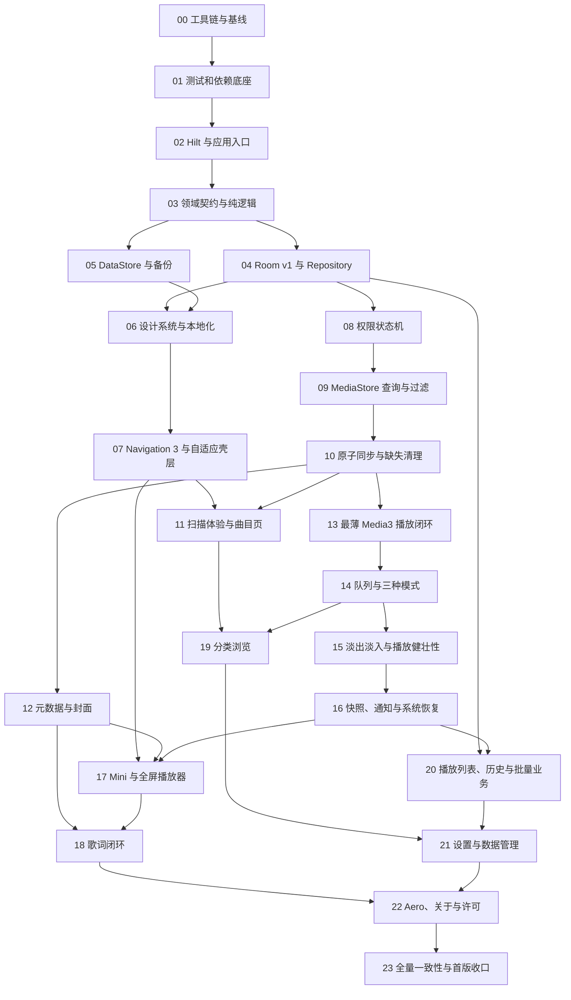

# MusicApp 首版逐过程执行计划

状态：可执行（2026-07-29）

## 1. 用途与边界

本文把 [`../design/implementation-spec.md`](../design/implementation-spec.md) 拆成可独立实现、可自动验证、可单独回退的执行过程。Wave Plan 继续承担范围与需求映射，实际开发按本文的过程依赖推进，不要求在一个 Wave 内一次完成全部内容。

- **自动门禁**：代理进入下一过程前必须通过的聚焦单元测试及固定 CI 任务。
- **用户验收清单**：交付给用户自行执行的设备、视觉与交互检查，不加入 CI，也不作为代理自动阻断门禁。
- 每个过程同步交付实现、必要 JVM 单元测试、English/简体中文资源和受影响文档。
- 不增加设备测试、截图测试、覆盖率、Release 构建或其他 CI 门禁。
- 共享 Gradle、Manifest、Room Schema、字符串资源、Route Key、MediaController 协议和设计令牌由单一所有者串行修改；接口冻结后，互不重叠的业务包才可并行。

## 2. 当前基线与固定验证

当前工程是单一 `:app` 模块，只包含 Compose、Material 3、Navigation 3、启动 Activity、单一 `Main` Route Key 和空页面；尚无 Hilt、Room、DataStore、Media3、Repository、ViewModel 或测试源码。

本机默认 shell 没有可用 Java Runtime；执行时先定位 JDK 17，并用任务专用变量设置环境。当前可用路径为：

```bash
MUSICAPP_JDK=/Users/huge/.gradle/jdks/eclipse_adoptium-17-aarch64-os_x.2/jdk-17.0.19+10/Contents/Home
env JAVA_HOME="$MUSICAPP_JDK" PATH="$MUSICAPP_JDK/bin:$PATH" java -version
```

每个过程按以下顺序验证：

1. 运行该过程新增或受影响的聚焦 `testDebugUnitTest` 测试类。
2. 使用 JDK 17 顺序执行固定 CI：

   ```bash
   env JAVA_HOME="$MUSICAPP_JDK" PATH="$MUSICAPP_JDK/bin:$PATH" \
     ./gradlew :app:testDebugUnitTest :app:lintDebug :app:assembleDebug --console=plain
   ```

3. 执行 `git diff --check`，检查意外生成物与未预期文件；任何一步失败都在当前过程内修复，不把失败带入下游。

当前基线实测三项任务通过，但 `testDebugUnitTest` 为 `NO-SOURCE`；过程 01 必须把它变成至少执行一个真实测试的任务。

## 3. 过程依赖



## 4. 可验证执行过程

### 00. 工具链与工程基线

- **前置**：当前干净工作树。
- **实现**：只核对 JDK 17、Android SDK、Gradle Wrapper、`minSdk 26`、`targetSdk 36`、单模块和现有 APK；不修改业务代码。
- **聚焦验证**：`java -version`、`android describe --project_dir=.`、固定三项 Gradle 任务、`git status --short --branch`。
- **完成条件**：记录可复用 JDK 17 路径；Debug APK 可生成；明确 `testDebugUnitTest` 当前为 `NO-SOURCE`。
- **用户验收清单**：无。
- **回退边界**：无文件变更。

### 01. 测试、依赖与 CI 底座

- **前置**：过程 00。
- **实现**：版本目录加入 Hilt、Room、Preferences DataStore、Media3、Lifecycle/ViewModel、Coroutines、JUnit4、`kotlinx-coroutines-test`、Turbine；配置 Room Schema 导出、Fake 目录、备份规则骨架和 JDK 17 CI；补齐被 Release 配置引用的 `proguard-rules.pro` 空规则文件。
- **聚焦验证**：新增 `ProjectSmokeTest`，确认 `testDebugUnitTest` 实际执行且不再为 `NO-SOURCE`；运行固定自动门禁。
- **完成条件**：依赖解析稳定，CI 只包含 `testDebugUnitTest`、`lintDebug`、`assembleDebug`，未引入 `INTERNET` 或 `POST_NOTIFICATIONS`。
- **用户验收清单**：安装 Debug APK，确认仍可冷启动到空壳页面。
- **回退边界**：Gradle、CI、备份规则和测试骨架可整体回退，不触及业务模型。

### 02. Hilt 与应用生命周期入口

- **前置**：过程 01。
- **实现**：建立 `MusicApplication`、Hilt Application/Activity 入口、应用级 Coroutine Scope、可替换 `Clock` 和随机源；只建立依赖边界，不创建业务表或 Player。
- **聚焦验证**：`ApplicationGraphTest` 验证时钟、随机源与应用作用域可替换；Hilt/KSP 编译及固定自动门禁通过。
- **完成条件**：Application、Activity 和未来 Service 的依赖作用域清晰，没有 UI 单例持有业务状态。
- **用户验收清单**：冷启动、旋转和从最近任务恢复均无崩溃。
- **回退边界**：Application、DI Module 和入口注解为单一回退单元。

### 03. 领域契约与纯业务规则

- **前置**：过程 02。
- **实现**：建立 `TrackId`、曲目、路径规则、播放上下文、播放队列、播放列表、历史、播放实例、播放模式、播放快照和设置模型；只写平台无关逻辑。
- **聚焦验证**：`TrackIdTest`、`PathRuleMatcherTest`、`PlaylistNamePolicyTest`、`PlayHistoryThresholdTest`、`PlaybackModePolicyTest` 覆盖复合身份、排除优先、名称规范化、`min(30 秒, 时长 50%)` 和默认列表循环。
- **完成条件**：模型命名与 [`../CONTEXT.md`](../CONTEXT.md) 一致；不引用 Android、Room、Media3 类型。
- **用户验收清单**：无。
- **回退边界**：领域包和对应测试整体回退；下游开始前冻结公开类型。

### 04. Room v1、DAO 与 Repository 契约

- **前置**：过程 03。
- **实现**：建立 `tracks`、`playlists`、`playlist_tracks`、`play_history`、`hidden_tracks`、`path_rules`、`playback_snapshot` 七张表、索引、DAO、事务、Repository 接口与 Fake，导出 v1 Schema；专辑、艺术家、文件夹均由 `tracks` 派生。
- **聚焦验证**：`MediaLibraryRepositoryTest`、`PlaylistRepositoryTest`、`HistoryRepositoryTest`、`PlaybackSnapshotRepositoryTest` 覆盖唯一性、位置、批量原子性、快照往返与空集合不破坏旧状态；Schema 文件存在且可解析。
- **完成条件**：Room 是媒体库及业务数据唯一事实来源；v1 发布前允许重建 Debug 数据，发布后只通过 Migration 演进。
- **用户验收清单**：写入样例数据后强停并重开，确认曲目、播放列表、历史和快照仍存在。
- **回退边界**：v1 Schema、DAO、Repository 实现保持同一回退单元。

### 05. Preferences DataStore、默认值与备份

- **前置**：过程 03。
- **实现**：实现主题、明暗、语言、Aero、淡出淡入时长和扫描模式；路径规则继续只保存在 Room；实现设置重置及 Auto Backup 白名单。
- **聚焦验证**：`SettingsRepositoryTest` 覆盖首次默认值、`0–2000 ms/250 ms` 校验、即时更新、语言值、扫描模式和重置保留项；备份规则检查确认数据库不进入备份。
- **完成条件**：DataStore 只保存设置，重置设置不删除 Room 数据。
- **用户验收清单**：无完整设置页时仅由测试验证，页面验收推迟到过程 21。
- **回退边界**：DataStore 键、序列化和 Repository 实现为同一回退单元；键名冻结后只兼容扩展。

### 06. 设计令牌、主题与双语资源

- **前置**：过程 04、05。
- **实现**：建立 `MusicDimensions`、`MusicShapes`、`MusicTypography`，四套预设色板、动态取色、Light/Dark、English 与简体中文资源一致性检查、共享加载/空态/错误态和 Snackbar 队列。
- **聚焦验证**：`DesignTokenPolicyTest` 检查三档窗口令牌，`StringResourceParityTest` 检查双语键一致，`SnackbarQueueTest` 检查单条展示和顺序排队；运行固定自动门禁。
- **完成条件**：页面不得硬编码可见文本、间距、圆角和字号；所有点击目标令牌至少 `48 dp`。
- **用户验收清单**：预览默认蓝与四套预设的 Light/Dark，确认文字和系统栏图标可读。
- **回退边界**：设计令牌与主题资源整体回退；下游消费后只兼容扩展。

### 07. Navigation 3、多返回栈与自适应壳层

- **前置**：过程 06。
- **实现**：建立八个可保存一级返回栈、详情 Route Key、紧凑推移式侧栏与中等/展开常驻三组卡片、共享 Scaffold、导航内容之上的应用级 Player Sheet 占位与 Edge-to-Edge Insets；紧凑侧栏宽度为窗口 `50%`，展开时主内容等距右移并裁切，中等和展开侧栏分别固定 `240 dp` 与 `256 dp`。
- **聚焦验证**：`NavigationStateTest` 覆盖切栈、重复点击回根、非单曲根页返回单曲、退出路径、配置与进程状态序列化；`WindowLayoutPolicyTest` 覆盖 `<600`、`600–839`、`≥840 dp` 及 `240/256 dp`。
- **完成条件**：业务页面只通过 Route Key 导航；Insets 在具体屏幕/列表消费，避免双重 padding。
- **用户验收清单**：自行检查三档窗口、旋转、语言重建、1.5 字体、系统栏与键盘避让。
- **回退边界**：壳层、Route Key 和共享导航状态为同一回退单元。

### 08. 运行时权限状态机

- **前置**：过程 04、07。
- **实现**：API 33+ 使用 `READ_MEDIA_AUDIO`，API 26–32 使用 `READ_EXTERNAL_STORAGE`；实现首次说明、请求、拒绝、永久拒绝与系统设置返回协调，不声明 `POST_NOTIFICATIONS`。
- **聚焦验证**：`MediaPermissionCoordinatorTest` 使用 Fake 权限网关覆盖各 API 分支、拒绝状态和设置返回；Manifest/Lint 与固定自动门禁通过。
- **完成条件**：权限逻辑不直接进入 Composable，未授权时不启动 MediaStore 查询。
- **用户验收清单**：自行在 API 26/32/33/36 检查允许、拒绝、永久拒绝和设置返回。
- **回退边界**：权限网关、协调器、Manifest 权限和说明 UI 同步回退。

### 09. MediaStore 查询、格式与路径过滤

- **前置**：过程 08。
- **实现**：查询全部可用外部卷；API 29+ 使用 `RELATIVE_PATH`，API 26–28 仅在适配层读取 `DATA`；实现七格式、时长、MIME/扩展名、系统音频和路径规则过滤。
- **聚焦验证**：`MediaStoreQuerySpecTest`、`AudioAdmissionPolicyTest`、`PathRuleMatcherTest` 覆盖七格式、时长为 0、MIME 缺失/冲突、排除优先、多卷复合身份和旧 API 路径归一化。
- **完成条件**：适配器只返回领域 DTO，不把 Cursor、绝对路径或平台异常泄漏到 UI/Repository。
- **用户验收清单**：使用含七格式、通知音、录音和多个目录的设备样本检查扫描候选。
- **回退边界**：查询适配器与过滤规则可整体回退，不修改 Room 已有数据。

### 10. 原子同步、暂时不可用与缺失曲目清理

- **前置**：过程 09。
- **实现**：建立同步代次、批量 Upsert、整体失败回滚、多卷状态、暂时不可用恢复；仅当已挂载卷完成一次成功的完整同步后，未发现曲目才连同播放列表关系、历史、隐藏状态和播放快照引用直接移除。
- **聚焦验证**：`MediaLibrarySyncTest` 覆盖首次同步、增量同步、查询整体失败保留旧缓存、卷卸载保留、权限丢失保留、成功完整同步缺失级联清理、重新发现暂时不可用曲目及事务回滚。
- **完成条件**：任何失败扫描都不提交“未出现即删除”；UI 不直接查询 MediaStore。
- **用户验收清单**：自行检查卷卸载/恢复、文件真实删除、权限关闭/恢复和重建缓存结果。
- **回退边界**：同步协调器和同步事务为同一回退单元；禁止只回退清理逻辑而保留不兼容事务。

### 11. 自动同步、扫描反馈与单曲页

- **前置**：过程 07、10。
- **实现**：实现 MediaStore 版本/卷集合比较、前台 ContentObserver、`1 秒` 防抖与一次后继同步；实现首次雷达、缓存顶部进度、首次/手动结果对话框、自动同步静默、单曲排序/隐藏/基础多选。
- **聚焦验证**：`LibrarySyncCoordinatorTest` 覆盖冷启动、内容变化合并、同步期间新变化、手动/自动反馈差异；`TracksViewModelTest` 覆盖加载、缓存、错误、排序、隐藏和状态恢复。
- **完成条件**：用户已能完成授权、扫描、查看、排序和隐藏曲目；重启后 Room 与页面一致。
- **用户验收清单**：自行检查首次无缓存、已有缓存、手动扫描、自动同步、失败重试及结果对话框全曲目惰性列表。
- **回退边界**：自动同步协调器、扫描反馈和单曲页可以分三个检查点回退，Room 同步契约不回退。

### 12. 高级元数据与专辑封面

- **前置**：过程 10。
- **实现**：实现按需标签读取、编码/比特率/采样率/文件大小、内嵌封面提取、占位图、缓存键和并发上限；歌词解析留到过程 18。
- **聚焦验证**：`MetadataReaderTest`、`ArtworkRepositoryTest` 覆盖缺失标签、损坏文件、缓存命中、并发限制、同 TrackId 更新和占位回退。
- **完成条件**：列表扫描不阻塞于高级元数据；读取失败不会让曲目退出媒体库。
- **用户验收清单**：自行检查有/无/损坏封面和歌曲信息字段。
- **回退边界**：元数据与封面适配器独立回退，不影响曲目基础表和播放 URI。

### 13. 最薄 Media3 后台播放闭环

- **前置**：过程 10，过程 04 已冻结快照结构。
- **实现**：建立 `MediaLibraryService`、单 ExoPlayer、MediaSession、MediaController 门面和最小列表循环队列；支持播放、暂停、上一首、下一首和 Seek；配置前台媒体播放权限与 Service。
- **聚焦验证**：`PlaybackControllerFacadeTest`、`BasicQueueNavigatorTest`、`ControllerConnectionPolicyTest` 覆盖基础命令、队首队尾及本应用/可信系统/其他控制器；Manifest/Lint 与固定自动门禁通过。
- **完成条件**：只有 Service 持有 Player/MediaSession，Activity/ViewModel 只依赖 Controller 门面。
- **用户验收清单**：自行检查真实文件播放、后台、任务划除、锁屏和系统媒体面板基础控制。
- **回退边界**：Service、Controller 门面和 Manifest 服务声明为同一回退单元。

### 14. 原始队列、稳定随机序列与三种播放模式

- **前置**：过程 13。
- **实现**：实现原始队列、稳定随机序列、列表循环、单曲循环、随机播放、跨轮去重、模式切换保留当前曲目，以及加入队列/下一首播放/移除当前曲目的规则。
- **聚焦验证**：`PlaybackQueueTest`、`ShuffleSequenceTest`、`PlaybackModeReducerTest` 覆盖空/单项/多项队列、两轮边界、退出随机、手动切歌和所有队列变更。
- **完成条件**：所有模式共用一个会话状态；队列与播放列表均无拖拽排序入口。
- **用户验收清单**：自行用 1、2、5 首曲目检查三模式、连续轮次和队列编辑结果。
- **回退边界**：高级队列协调器可整体退回过程 13 的最小列表循环。

### 15. 淡出淡入、错误、焦点与播放历史

- **前置**：过程 14。
- **实现**：实现单播放器淡出至静音后切歌再淡入、连续命令最后目标、`300 ms` 缓冲延迟、坏文件遍历、音频焦点、私密输出断开、播放实例计时与历史阈值。
- **聚焦验证**：`FadeThroughCoordinatorTest`、`PlaybackErrorRecoveryTest`、`AudioInterruptionPolicyTest`、`PlayHistoryRecorderTest` 使用 Fake Player、可控时钟和随机源覆盖全部竞态与一轮失败停止。
- **完成条件**：淡出淡入总时长遵守 `0–2000 ms/250 ms`；默认 `500 ms`；暂停、Seek、焦点变化不触发过渡。
- **用户验收清单**：自行检查默认过渡、连续上一首/下一首、暂停中断、坏文件、拔耳机和系统焦点变化。
- **回退边界**：播放协调器、历史记录器和中断策略分开提交，但快照字段变更必须保持兼容。

### 16. 播放快照、通知、划除与 Playback Resumption

- **前置**：过程 15。
- **实现**：实现队列/切歌/Seek/暂停/销毁快照、播放中每 `5 秒` 位置更新、通知三主操作、不可变 PendingIntent、划除停止、恢复卡片资格与用户触发恢复。
- **聚焦验证**：`PlaybackSnapshotCoordinatorTest`、`NotificationCommandPolicyTest`、`PlaybackResumptionPolicyTest` 覆盖写入触发、恢复但不自动播放、划除撤销资格、下一次主动播放恢复资格和快照中的缺失曲目清理。
- **完成条件**：系统媒体面板只暴露上一首、播放暂停、下一首；外部控制器无队列编辑和自定义命令。
- **用户验收清单**：自行检查通知划除、强停、进程终止、设备重启后的恢复入口与“用户操作后才播放”。
- **回退边界**：快照协调器与系统恢复策略必须同步回退，避免持久化格式和运行时状态分叉。

### 17. Mini Player、全屏播放器与队列 UI

- **前置**：过程 07、16、12。
- **实现**：实现一个应用级 Player Sheet 内重叠的 `80 dp` Mini 与 Full 两层、折叠/展开双锚点、跟手位移和分段 alpha 交叉；Full 承载封面/歌词/队列三页、进度与模式控制、队列点击/移除、手势仲裁、圆形/圆角封面和歌曲信息 Bottom Sheet/`640 dp` 对话框。
- **聚焦验证**：`PlayerViewModelTest`、`PlayerSheetStateTest`、`FullPlayerStateTest`、`PlayerGesturePolicyTest`、`QueueViewModelTest` 覆盖准备/缓冲/错误、折叠/展开与禁止隐藏、alpha 分段、页码恢复、返回折叠、手势优先级和队列操作。
- **完成条件**：UI 状态全部来自 ViewModel 与 MediaController；Player Sheet 展开与折叠不修改 Navigation 3 返回栈，折叠后原一级页面状态保持不变。
- **用户验收清单**：自行检查 Mini 到 Full 的跟手移动与交叉淡入淡出、三页滑动、顶部继续下拉折叠、底部阻尼、抽屉手势锁定、封面形状和歌曲信息承载形态。
- **回退边界**：Mini、全屏容器、各子页和歌曲信息组件按独立包回退，播放服务保持可用。

### 18. 歌词解析、同步与静态兜底

- **前置**：过程 12、17。
- **实现**：先在外部 LRC、SYLT、USLT 中选择带时间戳来源，再按该顺序确定优先级；仅三者均无时间戳时使用外部 LRC 静态文本或原始内嵌文本；实现编码、offset、多标签、坏行、三行状态、自动居中、`5 秒` 恢复与点击 Seek。
- **聚焦验证**：`LyricsSourceResolverTest` 明确覆盖“无时间戳外部 LRC + 有时间戳 SYLT”；`LrcParserTest`、`LyricsSynchronizerTest` 覆盖编码、offset、重复时间、坏行、静态兜底和三行值清空。
- **完成条件**：静态歌词绝不遮蔽可用同步歌词；无任何文本时使用 `lyrics_not_found`。
- **用户验收清单**：自行用外部 LRC、SYLT、USLT、纯文本和无歌词五组样本检查滚动、Seek 与兜底。
- **回退边界**：来源解析器、同步控制器和歌词 UI 分开回退，来源优先级契约保持不变。

### 19. 专辑、艺术家与文件夹分类浏览

- **前置**：过程 11、14。
- **实现**：实现专辑/艺术家派生查询、详情页、真实目录树、递归播放全部、独立排序和空态；复用过程 07 的列表/网格壳层与过程 14 的建队接口。
- **聚焦验证**：`AlbumGroupingTest`、`ArtistGroupingTest`、`FolderTreeTest`、`CategoryPlaybackContextTest` 覆盖同名不同 ID、合作标签不拆分、跨卷目录和递归建队。
- **完成条件**：分类页不建立重复缓存表，不直接查询 MediaStore。
- **用户验收清单**：自行检查同名专辑、多艺术家、跨目录、多卷和空分类。
- **回退边界**：albums、artists、folders 三个 feature 包可独立回退，共享查询接口兼容扩展。

### 20. 播放列表、历史与批量业务

- **前置**：过程 04、16、19。
- **实现**：实现播放列表创建/重命名/删除、批量添加/移除、详情、播放全部、历史列表/清空、多选、当前筛选全选、加入队列、下一首播放和隐藏；缺失曲目已在过程 10 级联移除。
- **聚焦验证**：`PlaylistUseCaseTest`、`BatchTrackActionTest`、`HistoryViewModelTest` 覆盖名称唯一、用户选择顺序、新增/跳过计数、事务失败、空列表不替换队列、全选范围和清空边界。
- **完成条件**：任何操作都不物理删除音频；播放列表固定按加入位置且不提供拖拽。
- **用户验收清单**：自行走通创建、重命名、批量添加/移除、播放全部、清空历史和缺失曲目清理。
- **回退边界**：playlists、history 和批量动作分开回退，DAO 破坏性变更必须与首个消费者同过程完成。

### 21. 设置页与数据管理

- **前置**：过程 19、20，依赖过程 05 的 SettingsRepository、过程 10 的扫描协调器和过程 15 的播放设置。
- **实现**：组装主题、明暗、语言、Aero、淡出淡入、扫描模式、路径规则；实现启动快照、待同步状态、重置配置、清空历史、删除全部播放列表和重建媒体库缓存确认。
- **聚焦验证**：`SettingsViewModelTest`、`PathRuleChangeCoordinatorTest`、`DataManagementUseCaseTest` 覆盖即时/下次切歌/下轮扫描生效时机、取消重扫、重置保留项和各清理范围。
- **完成条件**：设置 UI 不直接访问 DataStore/Room；重建缓存保留播放列表本身，但成功同步确认的缺失曲目及关联直接移除。
- **用户验收清单**：自行检查所有设置入口、确认文案、语言重建、待同步提示和数据管理范围。
- **回退边界**：设置组装、路径规则协调器和数据管理动作分别回退，持久化键与 Room Schema 不破坏。

### 22. Aero、关于与离线许可

- **前置**：过程 18、21。
- **实现**：实现流体网格、光晕气场、纯色静态、全屏封面混色、前后台/屏幕/省电/低电量/动画缩放降级；实现版本、开发者、致谢和离线开源许可。
- **聚焦验证**：`AeroDegradePolicyTest` 覆盖四类降级信号、动画缩放 0、条件全部解除后的恢复；`AboutMetadataTest` 检查版本与许可资源可离线读取。
- **完成条件**：降级时停止 Canvas 帧调度；许可和致谢不依赖网络；26 项功能均有可访问入口。
- **用户验收清单**：自行检查三种背景、全屏混色、前后台、省电、低电量、动画缩放 0、四主题和关于页。
- **回退边界**：Aero 引擎、降级策略和关于页可独立回退。

### 23. 全量一致性与首版收口

- **前置**：过程 00–22 全部自动门禁通过。
- **实现**：只修复全量单测、Lint、Debug 构建、双语资源和文档一致性暴露的问题；不在收口过程新增需求或破坏已冻结的 Room、Route Key、MediaController 和设计令牌契约。
- **聚焦验证**：运行全量固定自动门禁；检查 `values`/`values-zh-rCN` 键一致、26 项需求到过程映射、Manifest 权限/组件、无硬编码可见文本及 `git diff --check`。
- **完成条件**：JDK 17 下 `:app:testDebugUnitTest`、`:app:lintDebug`、`:app:assembleDebug` 全部通过，必要文档与实际代码状态一致。
- **用户验收清单**：由用户自行执行扫描、播放、队列、播放列表、歌词、语言主题、通知恢复、三档窗口和数据管理的最终验收。
- **回退边界**：每个收口修复保持小提交；不得用跨过程重写掩盖单点失败。

## 5. 并行执行边界

满足上游冻结条件后，可并行的安全组合只有：

- 过程 04 与 05：Room 和 DataStore 文件边界分离，共享领域模型只读。
- 过程 11、12、13：同步契约冻结后分别处理曲目 UI、元数据、播放服务；Gradle、Manifest、字符串和共享 Repository 由单一所有者串行合入。
- 过程 18、19、20：过程 16、17 接口冻结后分别处理歌词、分类、播放列表/历史；不得并发修改 Route Key、Room Schema 或 MediaController 公共协议。

其他过程按依赖图串行推进。任何并行工作在运行固定自动门禁前先完成共享接口集成与冲突检查。

## 6. 需求覆盖检查

- 需求 1、2、19、24：过程 08–11。
- 需求 3、12、13、18、20、21、23：过程 06、07、17、21。
- 需求 4–6、9、14、16、17：过程 13–17。
- 需求 10、11：过程 12、18。
- 需求 7、8、15：过程 19、20。
- 需求 22、25、26：过程 21、22。
- 双语资源、必要单元测试和文档：过程 01–23 持续交付，过程 23 全量收口。
