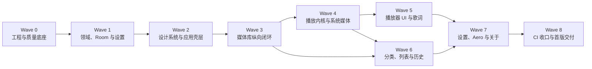

# MusicApp 首版开发 Wave Plan

状态：可执行（2026-07-29）

本文保留 Wave 范围、依赖图与需求映射；实际执行顺序和逐过程验证以 [`implementation-execution-plan.md`](implementation-execution-plan.md) 为准。

## 1. 执行原则

- Wave 按依赖顺序推进；上游门禁通过后，下游才可依赖其契约。
- 每个 Wave 同时交付实现、必要的纯逻辑 JVM 单测、少量 Robolectric 平台适配测试或 Android Runtime 集成测试、双语资源和必要文档。
- 每个页面在所属 Wave 同步交付语义标签、`48 dp` 点击目标和设计令牌。
- Room Schema、Repository 接口、MediaController 命令、Route Key 和设计令牌一旦被下游使用，只能兼容扩展；破坏性变更必须在同一 Wave 内完成迁移。
- 单个 Wave 可在冻结接口后并行实现互不重叠的包；共享 Gradle、Manifest、数据库 Schema、字符串资源和导航协议由一个所有者串行维护。
- 每个 Wave 结束固定使用 JDK 17 执行 `:app:testDebugUnitTest`、`:app:lintDebug`、`:app:assembleDebug`，并在有设备时执行 `:app:connectedDebugAndroidTest`。
- 无设备时可执行 `:app:assembleDebugAndroidTest` 做 Android 测试编译检查；它不等价于 Runtime 集成测试，也不构成其运行结果。

## 2. 依赖图

关键路径：稳定数据身份 → 原子媒体库 → 播放服务与队列 → 播放器体验 → 完整业务面 → CI 收口。

## 3. Wave 0：工程与质量底座

### 目标

把空白骨架升级为可持续迭代、能在每个后续 Wave 自动验证的工程底座。

### 实施

- 建立 `core/domain`、`core/designsystem`、`data`、`media`、`feature/*` 包边界。
- 接入 Hilt、Room、DataStore、Media3、Lifecycle/ViewModel、协程与所需图片/元数据能力。
- 建立 English、简体中文资源目录和字符串一致性检查。
- 配置 JUnit4、coroutines-test、Turbine、Room Schema 导出与 Fake 目录。
- 配置 JDK 17 CI，固定 `:app:testDebugUnitTest`、`:app:lintDebug`、`:app:assembleDebug`，并在设备可用时追加 `:app:connectedDebugAndroidTest`。
- 配置备份规则骨架与 Lint。
- 建立 `MusicApplication`、Hilt 测试 Application、可替换时钟与随机源。

### 门禁

- `:app:testDebugUnitTest`、`:app:lintDebug`、`:app:assembleDebug` 可执行；设备可用时 `:app:connectedDebugAndroidTest` 可执行。
- `testDebugUnitTest` 包含纯逻辑/Robolectric 测试；`ApplicationStartupIntegrationTest` 在 Android Runtime 中承担资源启动冒烟，不以 JVM 空任务作为完成证据。
- Room Schema 导出配置有效；v1 Schema 在 Wave 1 创建实体后生成。

## 4. Wave 1：领域、Room 与设置事实来源

### 依赖

Wave 0。

### 实施

- 实现 TrackId、曲目、播放列表、播放历史、路径规则、播放队列、播放模式和播放实例模型。
- 建立七张 Room 表、索引、DAO、事务并导出 v1 Schema；出现 v2 后才新增 v1→v2 及跨版本 Migration 测试。
- 实现 SettingsRepository 及全部默认值、即时生效和重置语义。
- 定义 MediaLibraryRepository、PlaylistRepository、HistoryRepository、PlaybackSnapshotRepository 接口及 Fake。
- 实现播放列表名称规范化、重复检查、批量新增计数和按加入位置排序。
- 实现播放快照的双队列、模式、位置和播放实例计时字段。

### 测试

- 名称规范化、路径规则优先级、播放历史阈值、三种播放模式纯逻辑 JVM 单元测试。
- DAO 唯一约束、批量事务、缺失曲目关联清理、快照往返与数据库迁移使用 Android Runtime Room 集成测试；对应 `MusicDatabaseMigrationTest`、`HistoryRepositoryTest`、`PlaylistRepositoryTest` 和 `PlaybackSnapshotRepositoryTest`。
- DataStore 默认值、更新和“只重置设置”测试。

### 门禁

- 数据库 Schema、Repository 接口和播放快照格式冻结。
- 本 Wave 新增的纯业务逻辑有对应单元测试。

## 5. Wave 2：设计系统与应用壳层

### 依赖

Wave 1 的设置流、Repository Fake 与领域模型。

### 实施

- 实现 `MusicDimensions`、`MusicShapes`、`MusicTypography` 的紧凑/中等/展开令牌。
- 实现动态取色、四套预设、Light/Dark 和系统栏图标策略。
- 实现 Navigation 3 八个一级可保存返回栈、详情路由与应用级 Player Sheet 占位。
- 实现 `<600 dp` 半宽推移式侧栏、`600–839 dp` 的 `240 dp` 常驻侧栏和 `≥840 dp` 的 `256 dp` 常驻侧栏，三档统一使用三组卡片。
- 实现共享 Scaffold、位于导航内容之上的 Player Sheet 占位区、Snackbar 队列、加载/空态/错误态组件。
- 实现可复用的曲目列表项、网格卡片、多选上下文栏和详情承载组件，先使用 Fake 数据验证。
- 接入应用语言切换、自动 LocaleConfig 与 Edge-to-Edge Insets。
- 建立八个一级页面的 Fake 数据占位状态，验证状态恢复。

### 测试

- 八栈切换、重复点击回根、五个媒体浏览根页动态锚定、扫描返回来源页、根页返回桌面与状态恢复的纯状态单元测试。

### 门禁

- 所有后续页面只能使用共享壳层和设计令牌。
- 导航状态在配置变化和进程恢复模拟中可重建。

## 6. Wave 3：媒体库纵向闭环

### 依赖

Wave 1 数据事实来源，Wave 2 壳层与共享状态。

### 实施

- 实现 API 分级权限说明、请求、拒绝与系统设置引导。
- 实现多存储卷 MediaStore 查询、MIME/扩展名准入、系统音频排除和路径规则。
- 实现同步代次、原子 Upsert、整体失败回滚、暂时不可用标记与重新发现恢复；完整同步成功后级联清理缺失曲目关联。
- 实现 MediaStore 版本/卷集合比较、前台 ContentObserver 和 `1 秒` 防抖。
- 实现首次雷达、缓存顶部进度、结果对话框成功曲目列表和重试。
- 实现单曲列表、独立排序记忆、隐藏状态和基本批量选择。
- 实现按需标签读取适配器、高级元数据、封面提取、缓存键与并发上限；歌词来源合并、同步控制和 UI 归 Wave 5。
- 实现可复用的扫描规则设置组件与扫描协调器；完整设置页由 Wave 7 组装。

### 测试

- 七格式、时长、MIME 冲突、路径排除优先和权限/协调策略使用 JVM 或少量 Robolectric 测试；Room 查询、缺失曲目级联清理、原子同步和同步失败边界使用 Android Runtime 集成测试，对应 `MediaLibraryRepositoryTest` 与 `MediaLibrarySyncTest`。
- 需要真实 Context 或 MediaStore API 的窄平台适配继续使用少量 Robolectric；不把真实 Room/Hilt 行为归入该层。

### 门禁

- 用户可完成授权、扫描、查看与排序曲目，重启后媒体库一致。
- 扫描失败不会损坏已有缓存，任何 UI 均不直接查询 MediaStore。
- 本 Wave 新增的纯业务逻辑有对应单元测试。

## 7. Wave 4：播放内核与系统媒体

### 依赖

Wave 3 可用曲目与 URI，Wave 1 快照和设置。

### 实施

- 实现 MediaLibraryService、单 ExoPlayer、MediaSession 与 MediaController 门面。
- 实现受信控制器连接策略和标准浏览/播放命令集合。
- 实现原始队列、稳定随机序列、三种互斥模式和全部队列变更规则。
- 实现快进退、上一首、错误遍历、准备态和 `300 ms` 缓冲延迟。
- 实现单播放器淡出淡入状态机及连续命令、焦点、输出断开、解码失败收敛。
- 实现音频焦点、私密输出断开、播放实例计时和历史写入。
- 实现快照触发、`5 秒` 位置更新和用户触发的 Playback Resumption。
- 实现通知/锁屏三主操作、元数据、划除停止和恢复卡片撤销。

### 测试

- 模式、随机轮次、双队列变更、移除当前项、坏文件遍历与历史计时使用纯逻辑 JVM 单元测试。
- 使用 Fake Player、可控时钟和 Fake AudioFocus/Noisy 事件覆盖淡出淡入、焦点与输出断开的业务竞态；`PlaybackServiceHiltTest` 在 Android Runtime 验证真实 Hilt Service 图可用。

### 门禁

- 无 UI 直接持有 Player；所有播放操作经 MediaController 门面。
- 从媒体库点击曲目可后台播放，并通过系统媒体面板控制与恢复。
- 前台服务权限、Service 导出、受信控制器和 PendingIntent 按功能规格实现。
- 本 Wave 新增的纯业务逻辑有对应单元测试。

## 8. Wave 5：播放器 UI、队列与歌词

### 依赖

Wave 4 播放状态与命令，Wave 3 元数据和封面。

### 实施

- 实现一个应用级 Player Sheet 内的 `80 dp` Mini 与 Full 重叠层、折叠/展开双锚点、交叉淡入淡出、播放状态、主操作和 Snackbar 安全位置。
- 实现全屏封面/歌词/队列三页、页码恢复、抽屉锁定和纵横手势优先级。
- 实现完整播放控制、播放模式入口、进度拖动、缓冲与错误反馈。
- 实现队列查看、点击跳转和移除；所有模式均不提供拖拽排序。
- 实现外部 LRC、SYLT、USLT 解析与静态歌词兜底。
- 实现歌词三行状态、自动居中、`5 秒` 恢复和点击 Seek。
- 实现歌曲信息 Bottom Sheet/对话框与只复制路径。
- 实现全屏圆形封面、其他圆角封面及仅全屏的封面混色。

### 测试

- 歌词带时间戳来源优先级、编码、多标签、offset、坏行、静态兜底与同步控制器单元测试。
- 播放器状态、队列操作、手势优先级和状态恢复的纯状态单元测试。

### 门禁

- 播放器从迷你态到全屏三页形成完整可用闭环。
- 播放 UI 状态完全来自 MediaController 与 ViewModel。
- 本 Wave 新增的纯业务逻辑有对应单元测试。

## 9. Wave 6：分类浏览、播放列表与历史

### 依赖

Wave 2 共享曲目组件，Wave 3 媒体查询，Wave 4 播放建队；可与 Wave 5 并行。

### 实施

- 实现专辑、艺术家、文件夹派生查询与详情页。
- 实现文件夹真实目录树及递归“播放全部”。
- 实现播放列表创建、重命名、删除、批量添加/移除、详情和“播放全部”。
- 播放列表曲目固定按加入位置，不提供拖拽排序。
- 实现历史列表、清空历史和播放次数展示。
- 完成曲目列表多选、全选当前筛选结果、加入播放列表/队列、下一首播放、隐藏。
- 完成各页面独立排序记忆和空态/错误态。

### 测试

- Album ID、Artist ID、目录树、递归播放与排序查询的纯逻辑测试。
- 播放列表唯一名称、重复项、新增/跳过计数、不可用曲目和空列表使用 JVM 业务测试；真实播放列表/历史 Repository 事务使用 Android Runtime，对应 `PlaylistRepositoryTest` 与 `HistoryRepositoryTest`。
- 多选、批量业务、播放全部建队和历史状态使用 JVM 单测；Room 级联与持久化边界不在 JVM 单测中替代验证。

### 门禁

- 八个一级入口中的全部媒体业务页面具备真实数据闭环。
- 批量操作不物理删除音频，失败不会留下部分事务。
- 本 Wave 新增的纯业务逻辑有对应单元测试。

## 10. Wave 7：设置、Aero、数据管理与关于

### 依赖

Wave 2 主题壳层，Wave 3 扫描协调器，Wave 4 播放设置，Wave 5 全屏播放器与封面混色，Wave 6 数据入口。

### 实施

- 完成主题、明暗、语言、Aero、淡出淡入、扫描模式和路径规则设置。
- 实现设置即时生效、淡出淡入下次切歌生效、扫描规则按启动快照执行。
- 实现路径规则变更后的确认扫描或“待同步”状态。
- 实现流体网格、光晕气场、纯色静态与主题表面遮罩。
- 接入前后台、屏幕、省电、低电量及动画缩放降级。
- 实现重置配置、清空历史、删除全部播放列表、重建媒体库缓存。
- 实现关于、版本、开发者、致谢和离线开源许可。

### 测试

- 设置默认值、生效时机、重置保留项与独立数据清理测试。
- Aero 四类降级信号和恢复测试。
- 语言重建后导航、播放与滚动状态恢复的纯状态单元测试。
- `AboutMetadataTest` 在 Android Runtime 验证安装包版本与许可资源可离线读取。

### 门禁

- 26 项功能均有可访问入口。
- 数据管理动作的删除范围与确认文案符合规格。
- 本 Wave 新增的纯业务逻辑有对应单元测试。

## 11. Wave 8：CI 收口与首版交付

### 依赖

Wave 0–7 全部完成。

### 实施

- 确认 26 项功能都已完成所属 Wave 的实现与对应分层测试。
- 修复固定 CI 暴露的 JVM/Robolectric 测试、Android Runtime 集成测试、Lint 或 Debug 构建问题。
- 同步最终 English/简体中文资源与必要文档。

### 最终门禁

- JDK 17 下执行 `:app:testDebugUnitTest`。
- JDK 17 下执行 `:app:lintDebug`。
- JDK 17 下执行 `:app:assembleDebug`。
- 有设备时执行 `:app:connectedDebugAndroidTest`；无设备时只能执行 `:app:assembleDebugAndroidTest` 编译检查，并单独记录未运行设备集成测试。

## 12. 需求到 Wave 的映射

| 需求 | 实现 Wave | 功能测试 Wave | CI 收口 |
|---|---|---|---|
| 1 音频扫描器 | 1、3 | 3 | 8 |
| 2 曲目列表 | 2、3、6 | 3、6 | 8 |
| 3 侧边栏路由导航 | 2 | 2 | 8 |
| 4 播放控制 | 4、5 | 4、5 | 8 |
| 5 播放模式 | 1、4、5 | 1、4、5 | 8 |
| 6 淡出淡入 | 1、4、7 | 4、7 | 8 |
| 7 播放列表管理 | 1、6 | 1、6 | 8 |
| 8 播放列表详情 | 1、6 | 6 | 8 |
| 9 播放历史 | 1、4、6 | 1、4、6 | 8 |
| 10 同步歌词 | 3、5 | 5 | 8 |
| 11 专辑封面 | 3、5 | 3、5 | 8 |
| 12 迷你播放器 | 2、5 | 2、5 | 8 |
| 13 全屏播放器 | 2、5 | 2、5 | 8 |
| 14 播放队列 | 1、4、5 | 1、4、5 | 8 |
| 15 分类浏览 | 3、6 | 3、6 | 8 |
| 16 通知控制 | 0、4 | 4 | 8 |
| 17 MediaSession | 0、4 | 4 | 8 |
| 18 歌曲信息 | 3、5 | 5 | 8 |
| 19 运行时权限 | 0、3 | 3 | 8 |
| 20 多主题 | 1、2、7 | 2、7 | 8 |
| 21 明暗模式 | 1、2、7 | 2、7 | 8 |
| 22 Aero | 1、7 | 7 | 8 |
| 23 中英双语 | 0–7 同步交付 | 2–7 | 8 |
| 24 扫描反馈 | 2、3 | 3 | 8 |
| 25 设置与偏好 | 1、3、7 | 1、3、7 | 8 |
| 26 关于 | 2、7 | 7 | 8 |
